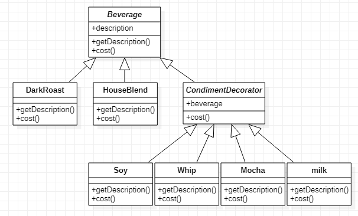

## 装饰者模式

#### 1. 定义

> 动态地将责任附加到对象上。

> 装饰类需要保持与实体类相同类型，也要继承公共抽象类，另外通过组合引用公共抽象类（实际上是实体类对象，装饰之后是装饰对象）

> 组成：公共抽象类Beverage/实体类`DarkRoast...`/装饰类`Decorator`/装饰类子类`Mocha...`。

#### 2. 场景

> 购买咖啡时，可以要求在其中加入一些调料。然后根据所加入的调料收费。
> 咖啡：Dark Roast、House blend...
> 调料：Mocha摩卡、Soy豆浆、whip奶泡、milk牛奶 ...

#### 3. 类图


#### 4. 实现

公共抽象类`Beverage`

```java
public abstract class Beverage {
    String description;

    public String getDescription(){
        return description;
    }
    public abstract double cost();
}
```

实体类`DarkRoast`

```java
public class DarkRoast extends Beverage {
    public String getDescription(){
       return "dark roast, ";
    }
    @Override
    public double cost() {
        return 10;
    }
}
```

装饰类 `CondimentDecorator`

```java
public abstract class CondimentDecorator extends Beverage {
    Beverage beverage;
    // 让子类必须实现这个方法
    public abstract String getDescription();
}
```

装饰实体类`Whip`

```java
public class Whip extends CondimentDecorator {
    public Whip(Beverage beverage){
        this.beverage = beverage;
    }

    public String getDescription(){
        return beverage.getDescription() + "whip, ";
    }
    @Override
    public double cost() {
        return beverage.cost() + 2;
    }
}
```

#### 5. 应用

> Java I/O包 使用装饰者模式

`InputStream`(还有`OutputStream`和`Reader/Writer`)相当于`Beverage`

`FileInputStream`...相当于`DarkRoast`

`FilterInputStream`相当于`CondimentDecorator`

`DataInputStream`...相当于`Whip`


完整代码 -> [GitHub](https://github.com/hongweihao/daily-study/tree/master/src/main/java/mkii/designPattern/decorator)

