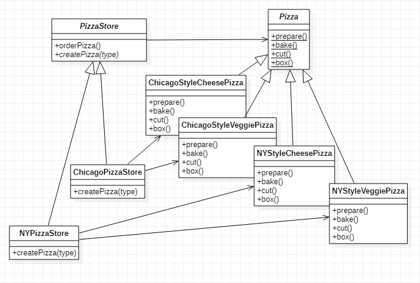

## 工厂模式(3个组成)

### 一、简单工厂

#### 1. 定义

> 将程序中需要用到`new`创建对象的部分抽取出来，并交由一个`factory`管理。

> 关键点在于抽取变化的代码中的`new`行为交由第三方控制，将直接影响的部分解耦。

#### 2. 场景

> 有一个pizza店，有不同口味的pizza。设计成`Pizza`类，且新增一个pizza种类需要继承`Pizza`类。创建一个pizza需要使用分支语句去选择pizza。当需要更新pizza种类的时候就需要改代码，`PizzaStore`类永远不稳定。
>
> 当前pizza类型：Cheese Pizza、Veggie Pizza、Clam Pizza、Pepperoni Pizza
>
> 
>
> ```Java
> public class PizzaStore {
> 
>     public void orderPizza(String type) {
> 
>         // 决定做一个什么类型的pizza
>         Pizza pizza;
>         if ("cheese".equals(type)) {
>             pizza = new CheesePizza();
>         } else if ("veggie".equals(type)) {
>             pizza = new VeggiePizza();
>         } else if ("clam".equals(type)) {
>             pizza = new ClamPizza();
>         } else if ("pepperoni".equals(type)) {
>             pizza = new PepperoniPizza();
>         } else {
>             pizza = null;
>         }
> 
>         // 其他工序
>         pizza.prepare();
>         pizza.bake();
>         pizza.cut();
>         pizza.box();
>     }
> }
> ```

> 简单工厂的解决方法是将变化的部分抽取出来，交由第三方(`SimpleFactory`)管理。

#### 3. 类图


#### 4. 实现

`PizzaStore`

```java
public class PizzaStore {
    public void orderPizza(String type) {

        // 决定做一个什么类型的pizza
        Pizza pizza = SimpleFactory.createPizza(type);

        // 还没有这个类型的pizza
        if (pizza == null) {
            System.out.println("please chose a pizza type from menu!");
            return;
        }

        // 其他工序
        pizza.prepare();
        pizza.bake();
        pizza.cut();
        pizza.box();
    }
}
```

`SimpleFactory`

```java
public class SimpleFactory {

    public static Pizza createPizza(String type){
        Pizza pizza;
        if ("cheese".equals(type)) {
            pizza = new CheesePizza();
        } else if ("veggie".equals(type)) {
            pizza = new VeggiePizza();
        } else if ("clam".equals(type)) {
            pizza = new ClamPizza();
        } else if ("pepperoni".equals(type)) {
            pizza = new PepperoniPizza();
        } else {
            pizza = null;
        }
        return pizza;
    }
}
```

`Pizza`

```java
public abstract class Pizza {
    // 准备工作，和面，切菜等
    public abstract void prepare();
    // 烘烤
    public abstract void bake();
    // 切片
    public abstract void cut();
    // 包装
    public abstract void box();
}
```

 pizza实体类`CheesePizza`     *只提供一个*

```java
public class CheesePizza extends Pizza {
    @Override
    public void prepare() {
        System.out.println("preparing cheese pizza...");
    }

    @Override
    public void bake() {
        System.out.println("baking cheese pizza...");
    }

    @Override
    public void cut() {
        System.out.println("cutting cheese pizza...");
    }

    @Override
    public void box() {
        System.out.println("boxing cheese pizza...");
    }
}
```

测试类

```java
public class SimpleFactoryTest {
    public static void main(String[] args) {
        // 到pizza店
        PizzaStore pizzaStore = new PizzaStore();

        // 点一个cheese pizza
        pizzaStore.orderPizza("cheese");

        // 点一个veggie pizza
        pizzaStore.orderPizza("veggie");
    }
}
```


###  二、工厂方法模式

#### 1. 定义

> 定义了一个创建对象的接口，但由子类决定要实例化的类是哪一个。工厂方法让类把实例化推迟到子类。

> 关键点在于理解`PizzaStore`与其子类解耦。`PizzaStore`不需要知道pizza的实例来自哪里。
>
> 组成：pizza store可以看作一个creator，pizza看作一个product

#### 2. 场景

> 加盟店场景：因为用户的口味不同，每家加盟店都可能需要提供不同风味的pizza。
>
> 例如：`ChicagoPizzaStore`提供`ChicagoStyleCheesePizza`
>
> ​			`NYPizzaStore`提供`NYPizzaStoreCheesePizza`

#### 3. 类图



#### 4. 实现

`PizzaStore`

```java
public abstract class PizzaStore {
    public void orderPizza(String type) {

        // 决定做一个什么类型的pizza
        Pizza pizza = createPizza(type);

        // 还没有这个类型的pizza
        if (pizza == null) {
            System.out.println("please chose a pizza type from menu!");
            return;
        }

        // 其他工序
        pizza.prepare();
        pizza.bake();
        pizza.cut();
        pizza.box();
    }
    // 交由子类觉得实例化的类型
    public abstract Pizza createPizza(String type);
}
```

加盟店类`ChicagoPizzaStore`      *只提供一个*

```java
public class ChicagoPizzaStore extends PizzaStore {
    @Override
    public Pizza createPizza(String type) {
        Pizza pizza;
        if ("cheese".equals(type)) {
            pizza = new ChicagoStyleCheesePizza();
        } else if ("veggie".equals(type)) {
            pizza = new VeggiePizza();
        } else {
            pizza = null;
        }
        return pizza;
    }
}
```

`Pizza`

```java
public abstract class Pizza {
    // 准备工作，和面，切菜等
    public abstract void prepare();
    // 烘烤
    public abstract void bake();
    // 切片
    public abstract void cut();
    // 包装
    public abstract void box();
}
```

 pizza实体类`ChicagoStyleCheesePizza`     *只提供一个*

```java
public class ChicagoStyleCheesePizza extends Pizza {
    @Override
    public void prepare() {
        System.out.println("preparing Chicago Style Cheese Pizza...");
    }

    @Override
    public void bake() {
        System.out.println("baking Chicago Style Cheese Pizza...");
    }

    @Override
    public void cut() {
        System.out.println("cutting Chicago Style Cheese Pizza...");
    }

    @Override
    public void box() {
        System.out.println("boxing Chicago Style Cheese Pizza...");
    }
}
```

测试类

```java
public class FactoryMethodTest {
    public static void main(String[] args) {
        // 去Chicago的pizza店
        PizzaStore pizzaStore = new ChicagoPizzaStore();
        // 点一个cheese口味的pizza
        pizzaStore.orderPizza("cheese");

        // 去New York的pizza店
        PizzaStore pizzaStore1 = new NYPizzaStore();
        pizzaStore1.orderPizza("cheese");
    }
}
```


### 三、抽象工厂

#### 1. 定义

> 将程

> 关键点在于

#### 2. 场景

> 有一个pizza店，有不同口味的pizza。设计成`Pizza`类，且新增一个pizza种类需要继承`Pizza`类。创建一个pizza需要使用分支语句去选择pizza。当需要更新pizza种类的时候就需要改代码，`PizzaStore`类永远不稳定。
>
> 当前pizza类型：Cheese Pizza、Veggie Pizza、Clam Pizza、Pepperoni Pizza
>
> 

#### 3. 类图


#### 4. 实现

`PizzaStore`

```java

```

`SimpleFactory`

```java

```

`Pizza`

```java

```

 pizza实体类`CheesePizza`     *只提供一个*

```java

```

测试类

```java

```

