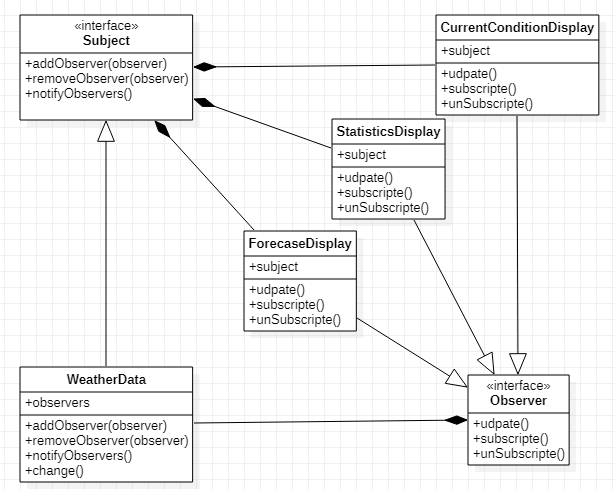

## 观察者模式

#### 1. 定义

> 定义了对象之间的一对多依赖，当一个对象改变状态时，他的所有依赖者都能收到通知并（更新）。

> 关键点在于subject对象会持有一组observer，当状态更新时调用observer相对应地处理方法。

> 组成：主题接口/主题接口实现类/观察者接口/观察者接口实现类/主题接口持有观察者接口的引用（list）。观察者对象的update方法也会有来自subject对象的数据

#### 2. 场景

> 气象观测站：由`WeatherData`对象负责追踪目前的天气状况（温度、湿度、气压）。现在有3个布告板。要求该对象获得最新数据时，3个布告板的信息同步更新。
>
> 布告板：目前状况(current condition) 、气象统计(Statistics)、天气预报(Forecast)
>
> ```properties
> # 打印
> current condition
> temperature: 12.0
> humidity: 13.0
> ----------------------------------------
> Statistics
> humidity: 13.0
> pressure: 14.0
> ----------------------------------------
> forecast
> temperature: 12.0
> pressure: 14.0
> ----------------------------------------
> ```

#### 3. 类图



#### 4. 实现

主题接口`Subject`

```java
public interface Subject {
    // 注册，订阅
    void addObserver(Observer observer);
    // 取消订阅
    void removeObserver(Observer observer);
    // 通知订阅者
    void notifyObserver();
}
```

`WeatherData`类

```java
import java.util.LinkedList;
import java.util.List;
public class WeatherData implements Subject {
    // 温度、湿度、气压
    private float temperature;
    private float humidity;
    private float pressure;
    // 订阅者对象列表  --组合
    private List<Observer> observers;

    public WeatherData(){
        observers = new LinkedList<>();
    }

    @Override
    public void addObserver(Observer observer) {
        observers.add(observer);
        //System.out.println("registered subject!");
    }

    @Override
    public void removeObserver(Observer observer) {
        observers.remove(observer);
    }

    @Override
    public void notifyObserver() {
        for (Observer observer : observers) {
            observer.update(getTemperature(), getHumidity(), getPressure());
        }
    }

    // 模拟数据发送变化
    public void change(float temperature, float humidity, float pressure){
        this.temperature = temperature;
        this.humidity = humidity;
        this.pressure = pressure;

        notifyObserver();
    }

    public float getTemperature() {
        return temperature;
    }
    public float getHumidity() {
        return humidity;
    }
    public float getPressure() {
        return pressure;
    }
}

```

`Observer`接口

```java
public interface Observer {
    void subscribe();
    void unSubscribe();
    void update(float temperature, float humidity, float pressure);
}
```

 布告板类     *只提供一个*

```java
public class CurrentConditionDisplay implements Observer {

    private Subject subject;

    public CurrentConditionDisplay(Subject subject) {
        this.subject = subject;
        subscribe();
    }

    @Override
    public void subscribe() {
        subject.addObserver(this);
    }

    @Override
    public void unSubscribe() {
        subject.removeObserver(this);
    }

    @Override
    public void update(float temperature, float humidity, float pressure) {
        System.out.println("current condition\ntemperature: " + temperature + "\nhumidity: " + humidity);
        System.out.println("----------------------------------------");
    }
}
```

#### 5. 应用


完整代码：[GitHub](https://github.com/hongweihao/daily-study/tree/master/src/main/java/mkii/designPattern/observer)

