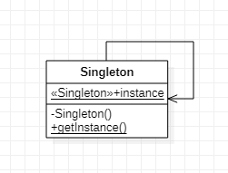

## 单例模式

#### 1. 定义

> 确保一个类只有一个实例，并提供一个全局访问点。

> **懒汉式**会有多线程问题：多个线程开始去实例化`Singleton`的时候，同时取到`instance==null`
> **饿汉式**会在加载类时就创建好实例，避免了多线程问题，但是有可能不需要用到的实例也会在加载时创建
> **双重检查加锁**：代码稍显复杂，可以避免多线程问题，且能在需要时再创建实例。

#### 2. 场景

> 要求一个类只能有一个实例。

#### 3. 类图



#### 4. 实现

饿汉式-急切实例化：

```java
/**
 * 饿汉式-急切实例化
 * 饿汉式的缺点就是，可能在还不需要此实例的时候就已经把实例创建出来了，没起到lazy loading的效果。
 * 优点就是实现简单，而且安全可靠。
 */
public class Singleton {
    static Singleton instance = new Singleton();
    private Singleton(){
    }
    public static Singleton getInstance(){
        return instance;
    }
}
```

懒汉式-延迟实例化：

```java
/**
 * 懒汉式-延迟实例化
 *
 */
public class Singleton2 {
    private static Singleton2 instance;
    private Singleton2(){

    }
    public static Singleton2 getInstance(){
        if (instance == null) { // 这里会出现多线程问题
            instance = new Singleton2();
        }
        return instance;
    }
}
```

同步方法：

```java
/**
 * 同步getInstance()方法
 */
public class Singleton3 {
    private static Singleton3 instance;
    private Singleton3(){

    }
    // 每次访问实例都会经历锁，如果频繁访问性能差
    public synchronized static Singleton3 getInstance(){
        if (instance == null) {
            instance = new Singleton3();
        }
    return instance;
    }
}
```

双重检查锁：

```java
/**
 * 双重检查锁
 *
 */
public class Singleton4 {
    // 表示instance的update对线程可见，实际上是告诉线程去主存取最新的值
    private static volatile Singleton4 instance;
    private Singleton4(){

    }
    public static Singleton4 getInstance(){
        if (instance == null) {
            // 只有第一次创建实例，多线程争夺资源时才会进入
            synchronized(Singleton4.class) {
                if (instance == null) {
                    instance = new Singleton4();
                }
            }
        }
        return instance;
    }
}
```

单对象枚举：

```java
/**
 * 枚举单例
 * 我们定义的一个枚举，在第一次被真正用到的时候，会被虚拟机加载并初始化，而这个初始化过程是线程安全的。
 */
public enum Singleton5  {
    // 直接使用Singleton5.instance获取实例，不需要getInstance()方法
    instance;
    public void method(){
        System.out.println(instance.getClass().getName());
    }
}
```

#### 5. 应用

> 

完整代码：[GitHub](https://github.com/hongweihao/daily-study/tree/master/src/main/java/mkii/designPattern/singleton)

