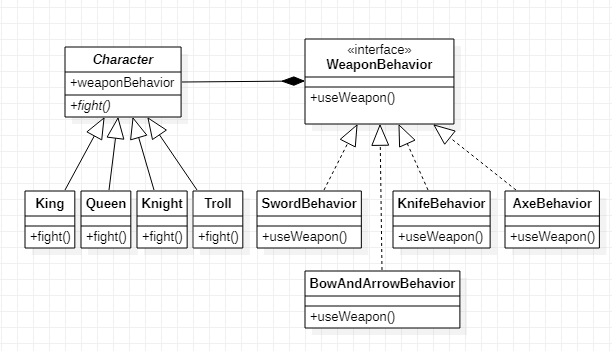

## 策略模式

#### 1. 定义

> 定义了算法族，分别封装起来，让它们之间可以互相转换。让算法族独立于使用算法族的对象，也就是说任意一个对象都能够使用这个算法族。

> 关键点在实现类的构造方法，在构造方法中可以选择将要使用的算法，也就是想创建的对象。

> 组成：角色类/角色类的子类/行为接口/行为接口的实现类。角色类持有行为类的引用（组合）

#### 2. 场景

> 一个游戏中有4种角色，国王(King)、皇后(Queen)、骑士(Knight)、巫师(Troll)。每个角色每次只能选择使用一种武器，但是可以在游戏过程种换武器。
>
> 武器4种：匕首(Knife)、弓箭(Bow and arrow)、斧头(Axe)、宝剑(sword)

#### 3. 类图



#### 4. 实现

角色抽象类 `Character`

```java
public abstract class Character {
    // 角色
    String roll;
    // 组合使用武器行为
    WeaponBehavior weapon;
    
    public void setWeapon(WeaponBehavior weapon){
        this.weapon = weapon;
    }
    public abstract void fight();
}
```

角色类子类 `King`  *（这里只提供一个）*

```java
public class King extends Character {

    // 关键在这里，可以动态选择武器
    public King(WeaponBehavior weapon){
        this.roll = "King";
        this.weapon = weapon;
    }

    @Override
    public void fight() {
        //  ignore 有可能行为不一样，如果一样也可以交由父类统一实现。
        // ignore 比如King使用sword有可能两倍伤害。Troll使用bow and arrow一定命中之类的功能
        System.out.print(roll);
        weapon.useWeapon();
    }
}
```

行为接口`WeaponBehavior`

```java
public interface WeaponBehavior {
    void useWeapon();
}
```

行为接口实现类 `SwordBehavior` *这里只提供一个*

```java
public class SwordBehavior implements WeaponBehavior {
    @Override
    public void useWeapon() {
        System.out.println(" use sword to fight!");
    }
}
```

测试类 `Strategy`

```java
/**
 * 场景：一个游戏中有4种角色，国王(King)、皇后(Queen)、骑士(Knight)、巫师(Troll)。
 * 每个角色每次只能选择使用一种武器，但是可以在游戏过程种换武器。
 * 武器4种：匕首(Knife)、弓箭(Bow and arrow)、斧头(Axe)、宝剑(sword)
 *
 */
public class Strategy {
    public static void main(String[] args) {

        // 有4种武器可以挑选
        WeaponBehavior sword = new SwordBehavior();
        WeaponBehavior knife = new KnifeBehavior();
        WeaponBehavior axe = new AxeBehavior();
        WeaponBehavior bowAndArrow = new BowAndArrowBehavior();

        // 有4个角色，它们选择各自的武器
        Character king = new King(sword);
        Character queen = new Queen(knife);
        Character knight = new Knight(axe);
        Character troll = new Troll(bowAndArrow);

        // 攻击
        king.fight();
        queen.fight();
        knight.fight();
        troll.fight();

        // 换武器
        troll.setWeapon(knife);
        troll.fight();
    }
}
```

#### 5. 应用

> `SpringMVC`的`ViewResolver`使用策略模式 -> [SpringMVC: 策略模式下的视图解析](https://juejin.im/post/5ce405d75188252db664847d)

完整代码：[GitHub](https://github.com/hongweihao/daily-study/tree/master/src/main/java/mkii/designPattern/strategy)

