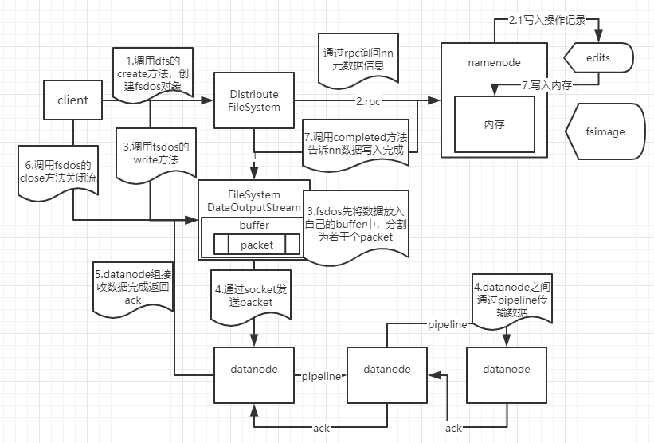

1. client 通过`DistributeFileSystem`的`create()`方法创建一个`FileSystemDataOutputStream`

2. 通过 RPC 向 NameNode 请求元数据存放的位置，NameNode 会在 namespace 中创建一个空的 Entry

3. client调用`fsdos`的`write()`方法，准备将数据写入 datanode中。写入之前会先将数据放入`fsdos`的 buffer中，并切成若干个 packet

4. 通过 socket 发送 packet 到 datanode 组中的一台 datanode，组中 datanode 之间有一条通道成为 pipeline，在此通道上依次逐个发送数据

5. 最后一个 datanode 接受完之后就发送ack给上一个，直到第一个 datanode 返回 ack 给`fsdos`（失败就会记录机器，下次不再访问，并由 namenode 重新分配一台机器存储副本）

6. client 调用`fsdos`的`close()`方法关闭流

7. client 调用`dfs`的`completed()`方法告诉 namenode 数据写入完成

