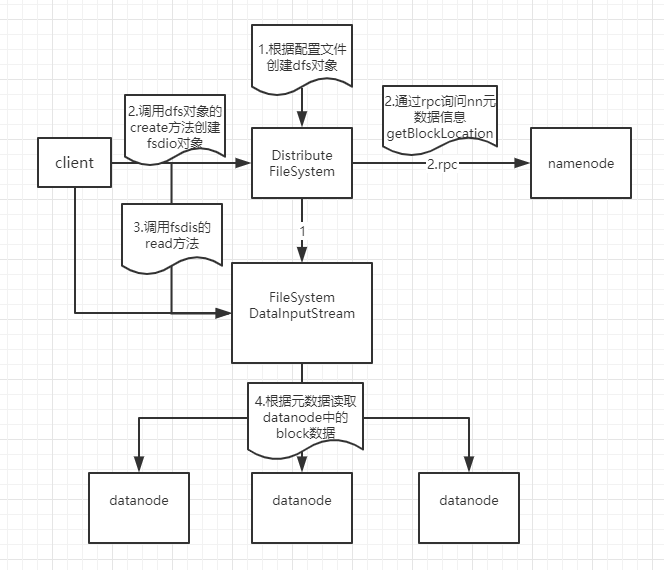

1. 从配置文件中初始化`dfs`

2. client 调用`dfs`的`create()`方法创建`fsdis`对象

3. 通过 rpc 向 namenode 请求 block 的位置（get block location）

4. client 调用`fsdis`的`read()`方法从 datanode 中读取数据

5. client 调用`fsdis`的`close()`方法关闭流

