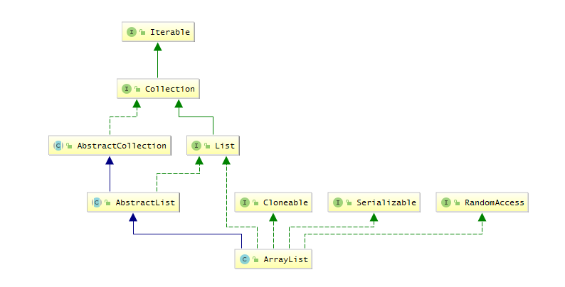

#### 1.概述
> 动态增长和缩减的索引序列，基于数组实现的`List`  
> 线程不安全，可以存放`null`  
> 数据结构：数组（查询快，插入删除慢）  
> 实现了`RandomAccess`，遍历时推荐使用for循环

> `RandomAccess`一个标记接口(mark interface：)，表示是否支持快速随机访问，即能否通过index直接定位到元素

关系图：
```
public class ArrayList<E> extends AbstractList<E>
        implements List<E>, RandomAccess, Cloneable, java.io.Serializable
```



#### 2.源码
##### 常用属性：
```
// 默认容量
int DEFAULT_CAPACITY = 10;

// 空对象数组，调用ArrayList()构造方法时，用此对象实例化elementData
Object[] EMPTY_ELEMENTDATA = {};

// 元素数组，ArrayList的核心数组
transien Object[] elementData;

// 最大数组容量
int MAX_ARRAY_SIZE=Integer.MAX_VALUE - 8;
```

##### 常用构造方法：
```
// 指定容量
public ArrayList(int initialCapacity);

// 不指定容量，默认为10
public ArrayList();
```

##### 核心方法：
```
/**
 * 在数组尾部添加一个元素
 */
public boolean add(E e) {
    // 确保数组的容量
    ensureCapacityInternal(size + 1);  // Increments modCount!!
    elementData[size++] = e;
    return true;
}
```

```
/**
 * 确保数组的容量
 */
private void ensureCapacityInternal(int minCapacity) {
    // 判断是否空数组
    if (elementData == EMPTY_ELEMENTDATA) {
        // 这里实际做的就是预测一个size，并没有真正改变
        minCapacity = Math.max(DEFAULT_CAPACITY, minCapacity);
    }
    // 确保实际容量
    ensureExplicitCapacity(minCapacity);
}
```

```
/**
 * 确保实际容量
 */
private void ensureExplicitCapacity(int minCapacity) {
    modCount++;

    // 若elementData为空，则minCapacity=DEFAULT_CAPACITY,若初始化使用默认容量10，则不需要调用grow()扩容
    // 反之，minCapacity=size+1,扩容
    if (minCapacity - elementData.length > 0){
        // 扩容
        grow(minCapacity);
    }
}
```

```
/**
 * 扩容
 */
private void grow(int minCapacity) {
    // 扩充前的数组长度
    int oldCapacity = elementData.length;
    
    // 扩充后的数组长度，右移一位可以理解为/2^1
    int newCapacity = oldCapacity + (oldCapacity >> 1);
    if (newCapacity - minCapacity < 0)
        newCapacity = minCapacity;
        
    // 若超出最大容量，那么调用hugeCapacity给能给的最大值
    if (newCapacity - MAX_ARRAY_SIZE > 0)
        newCapacity = hugeCapacity(minCapacity);
    // 把旧的数据复制到新数组中
    elementData = Arrays.copyOf(elementData, newCapacity);
}
```

```
/**
 * 给出最大的容量
 * MAX_ARRAY_SIZE应该是为了防止溢出做的保险
 */
private static int hugeCapacity(int minCapacity) {
    if (minCapacity < 0) // overflow
        throw new OutOfMemoryError();
    return (minCapacity > MAX_ARRAY_SIZE) ?
        Integer.MAX_VALUE :  //Integer.MAX_VALUE:2147483647
        MAX_ARRAY_SIZE;      //MAX_ARRAY_SIZE：2147483639
}
```
> 比较难理解的方法就上面这些，最核心的是grow()，其他的虽然也很重要，但理解起来相对简单些，这里就不展开细说了。  

> 初始化时，若不指定容量。则会调用grow()方法初始化elementData。

### 参考
[Java集合源码分析（一）ArrayList](https://www.cnblogs.com/zhangyinhua/p/7687377.html)

可以看一下我用Java写的[线性表的顺序实现](https://gitee.com/mkii/studyTree/blob/master/code/src/main/java/com/mkii/code/data/SeqList.java)，原理差不多