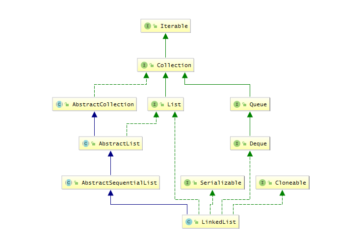

#### 1.概述
> 高效插入和删除的有序序列  
> 线程不安全，非同步  
> 数据结构：链表（双向链表）  
> 继承了`AbstractSequentialList`,可以作为栈和队列使用  
> 实现了`Deque `，可以做双向链表
> 遍历时推荐使用`iterater`

关系图：
```
public class LinkedList<E>
    extends AbstractSequentialList<E>
    implements List<E>, Deque<E>, Cloneable, java.io.Serializable
```



#### 2.源码
##### 常用属性：
```
// 元素个数
transient int size = 0;
// 头节点
transient Node<E> first;
//尾节点
transient Node<E> last;


// 记录修改次数，与线程有关的属性(平时使用并不多)
protected transient int modCount = 0;
```

##### 常用构造方法：
```
// 默认构造方法
public LinkedList() {}

// 指定添加元素，并不常用
public LinkedList(Collection<? extends E> c) {
    this();
    addAll(c);
}
```

##### 核心内部类：
```
/**
 * 链表的数据结构
 */
private static class Node<E> {
    E item;         // 数据域
    Node<E> next;   // 下一个结点
    Node<E> prev;   // 上一个结点

    Node(Node<E> prev, E element, Node<E> next) {
        this.item = element;
        this.next = next;
        this.prev = prev;
    }
}
/**
 * 主要与LinkedList的迭代有关
 * 而且在迭代的过程中能对元素进行操作
 */
private class ListItr implements ListIterator<E> {
    private Node<E> lastReturned = null;
    private Node<E> next;
    private int nextIndex;
    private int expectedModCount = modCount;
    
    // methods()....
}
```


##### 核心方法：
```
/**
 * 添加元素到链表尾部
 */
public boolean add(E e) {
    // 实际添加到末尾
    linkLast(e);
    return true;
}

/**
 * Links e as last element.
 */
void linkLast(E e) {
    final Node<E> l = last;
    final Node<E> newNode = new Node<>(l, e, null);
    last = newNode;
    if (l == null)
        first = newNode;
    else
        l.next = newNode;
    size++;
    modCount++;
}
// ---------
```
> 重点看一下删除元素的过程

```
/**
 * Removes the first occurrence of the specified element from this list
 * 移除链表第一个匹配的元素
 */
public boolean remove(Object o) {
    // 遍历链表，找到符合的结点，再使用unlink真正移除该结点
    if (o == null) {
        for (Node<E> x = first; x != null; x = x.next) {
            if (x.item == null) {
                unlink(x);
                return true;
            }
        }
    } else {
        for (Node<E> x = first; x != null; x = x.next) {
            if (o.equals(x.item)) {
                unlink(x);
                return true;
            }
        }
    }
    // 没找到则返回 false
    return false;
}

/**
 * Unlinks non-null node x.
 */
E unlink(Node<E> x) {
    // assert x != null;
    final E element = x.item;
    final Node<E> next = x.next;
    final Node<E> prev = x.prev;

    // 移除头结点，头结点改变成头结点的next
    if (prev == null) {
        first = next;
    } else {
        // 移除中间结点的一半引用(指针)操作（这个操作自己画一张图看起来更加直观）
        prev.next = next;
        x.prev = null;
    }

    // 移除尾结点，尾结点改变为尾结点的pre
    if (next == null) {
        last = prev;
    } else {
        // 移除中间结点的另一半引用(指针)操作
        next.prev = prev;
        x.next = null;
    }

    // 前面的prev和next的引用都清除了，现在清楚数据域的引用
    x.item = null;
    size--;
    modCount++;
    return element;
}
```

> 上面这些方法中，重点学习unlinck()，在指定位置插入也是相似的。  

### 参考
[Java集合源码分析（二）Linkedlist](https://www.cnblogs.com/zhangyinhua/p/7688304.html)

可以看一下我用Java写的[线性表的链式实现](https://gitee.com/mkii/studyTree/blob/master/code/src/main/java/com/mkii/code/data/LinList.java)