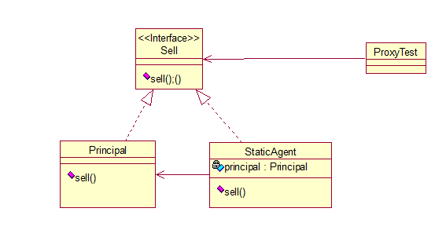
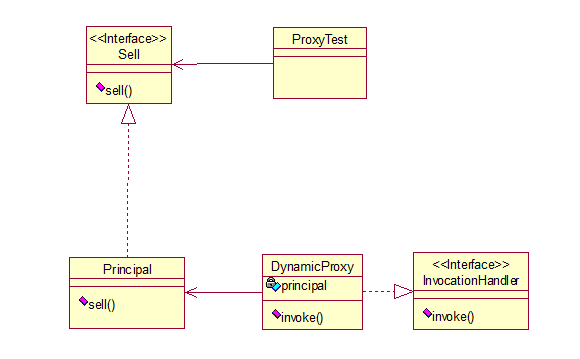

> 静态代理和动态代理，类图：




```
/**
 * 委托类的上层接口
 * 在静态代理中是委托类和代理类的上层接口
 *
 */
public interface Sell {
    void sell();
}
```

```
/**
 * 委托类，被代理类
 *
 */
public class Principal implements Sell {
    @Override
    public void sell() {
        System.out.println("Principal sales");
    }
}
```

```
/**
 * 代理类，静态代理
 * 
 */
public class StaticAgent implements Sell {
    private Principal principal = new Principal();

    @Override
    public void sell() {
        System.out.println("static");
        principal.sell();
    }
}
```

```
/**
 * 动态代理的代理类，不再与委托类实现同一个接口
 *
 */
public class DynamicAgent implements InvocationHandler {
    private Sell principal = new Principal();

    @Override
    public Object invoke(Object proxy, Method method, Object[] args) throws Throwable {
        System.out.println("dynamic");
        return method.invoke(principal, args);
    }
}
```

```
import java.lang.reflect.Proxy;
/**
 * 测试类
 */
public class ProxyTest {
    public static void main(String[] args) throws Exception{

        // 静态代理
        Sell sell1 = new StaticAgent();
        sell1.sell();

        // 动态代理
        DynamicAgent dynamicAgent = new DynamicAgent();
        Sell sell2 = (Sell) Proxy.newProxyInstance(Sell.class.getClassLoader(), new Class[]{Sell.class}, dynamicAgent);
        sell2.sell();
    }
}
```