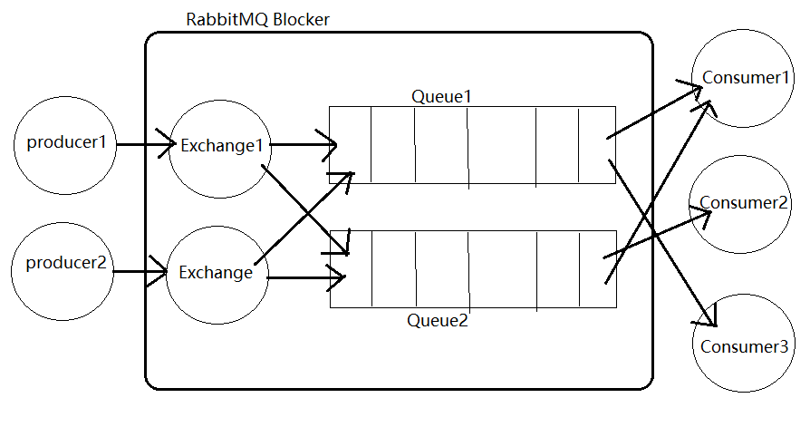

## RabbitMQ面试题

### 1. 什么是RabbitMQ？

> 基于AMQP协议，使用erlang编写的企业级消息队列。

### 2. 使用场景
> 1. 异步通信：短信、Email
> 2. 解耦：发送方和接收方解耦
> 3. 削峰：队列存储消息，慢慢处理

### 3. 角色
> - 生产者：push data and message to queue
>
> - 消费者：deal with data and confirm message
>
> - 代理：RabbitMQ 本身，“快递”角色
>
>   provider/consumer/exchange/queue

### 4. 重要组件

> - `ConnectFactory`应用程序与RabbitMQ之间连接的管理器
> - `Channel`消息推送的通道
> - `Exchange`接收/分配消息
> - `Queue`存储生产者的消息
> - `RoutingKey`把生产者的数据分配到交换器上
> - `BindingKey`把交换的消息绑定到队列上

### 5. vhost 的作用

[RabbitMQ概念篇 vhost](https://www.cnblogs.com/hongjh/p/7644718.html)]

> 最主要的应用是对应的用户拥有独立的权限系统。例如一个broker中有两个vhost，user1拥有vhost1的权限，user2拥有vhost2的权限。
>
> **不同应用跑在不同的vhost中 **

### 6. 消息是怎么发送的？

> 1. 客户端连接到 RabbitMQ Server，它们之间会创建一个 TCP 连接
> 2. 通过 TCP 认证 RabbitMQ Server 的用户名密码
> 3. 客户端和 RabbitMQ 在TCP上的虚拟连接创建一条 AMQP Channel
> 4. 每个 Channel 都有一个用于发布消息/订阅队列等的唯一ID

### 7. 怎么避免消息丢失 | 保证消息的可靠性

[RabbitMQ实现可靠性消息投递---保证消费者接收到消息](https://blog.csdn.net/weiwei_six/article/details/104125521)

在消息投递的过程中，有4处地方需要保证可靠性：

> 1. 确保消息从 Producer 到 Exchange：
>    - Transaction模式：事务执行有始有终。缺点：网络原因容易阻塞，性能消耗大。
>    - Confirm模式：Producer 将 Channel 设置为 confirm 模式，一旦消息被投递到对应的 queue，RabbitMQ会发送一个包含消息唯一ID的 ACK 包给 Producer
> 2. 确保消息从 Exchange 到 Queue：
>    - 让无法找到 Queue 的消息返回给 Producer：mandatory & ReturnLisener
>    - 让无法找到 Queue 的消息发送到**备份交换机 **
> 3. 确保消息在 Queue 正确的存储：
>    - Exchange & Queue 持久化：`durable=true`
>    - 镜像集群：其他机器也存储一样的内容
>    - 消息持久化：`BasicProperties.deliveryMode=2`
> 4. 确保消息从 Queue 正确投递到 Consumer：
>    - 消息确认机制 message acknowledgement：consumer 订阅 Queue时，可以设置 autoAck 参数。当 autoAck=false，RabbitMQ会等待 consumer 显示回复消息后才从 Queue 中移除消息。

### 8. RabbitMQ 有几种广播模式?

> 1. `fanout`：所有 binding 到此 Exchange 的 Queue 都能接收到消息
> 2. `direct`：通过 RoutingKey 和 Exchange 决定一个唯一的 Queue 能接收到消息
> 3. `topic`：所有符合RoutingKey 规则的 Queue 都能接收到消息

### 9. 集群中唯一的磁盘节点故障会发生什么？

> 集群能够正常运行，但是不能更新任何东西：
>
> - Create Queue / Exchange / Bind
> - Add User
> - update 权限
> - create / remove Node

### 10. 集群节点停止顺序？

> 先关闭内存节点，最后关闭磁盘节点
>
> 否则容易丢失消息

### 11. 如何避免消息重复投递 / 消费 | 保证幂等性？

<http://xiaorui.cc/archives/4493> 

> 在生产消息时，MQ会给每条消息分配一个 `innser-msg-id` 作为去重的依据，保证消息不被重复放入队列。
>
> 在消费消息时，要求消息体中必须含有一个业务Id `bizId` 作为去重依据，避免消息重复消费。
>
> `bizId` 对于同一业务全局唯一，如支付Id、订单Id等

### 12. MQ的缺点

> - 系统可用性降低：MQ本身也有可能故障，引入外部依赖越多可用性越低，越容易故障
> - 系统复杂度升高：需要考虑引入MQ带来的问题，如消息重复消费问题，消息丢失问题
> - 一致性问题：分布式事务的问题

### 13. 如何解决MQ延时以及过期失效问题

> RabbitMQ是可以设置消息过期时间（TTL）的，超时后消息会被MQ清理掉导致数据丢失。
>
> 如果设置了TTL导致消息丢失，需要手动找到丢失的消息，重新灌入队列中（批量重导）

### 14 如果解决MQ消息堆积问题

> 消息堆积本质上是 consumer 出现问题，或者是 consumer 处理速度慢
>
> - 事前：开发预警程序，监控最大的可堆积消息数，超过就发预警通知，不要等到Prod出故障再解决。
> - 事中：检查并修复 consumer 问题，如紧急重启
> - 事后：对 consumer 紧急扩容，增加消息进程